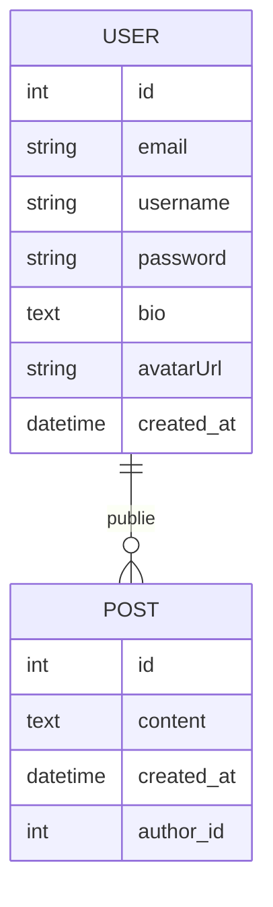
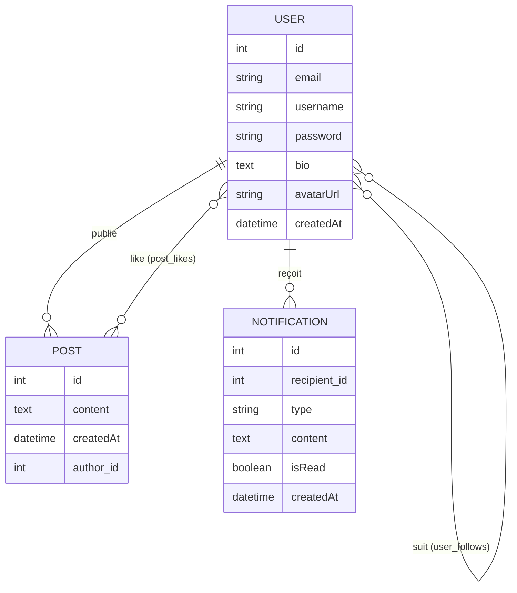
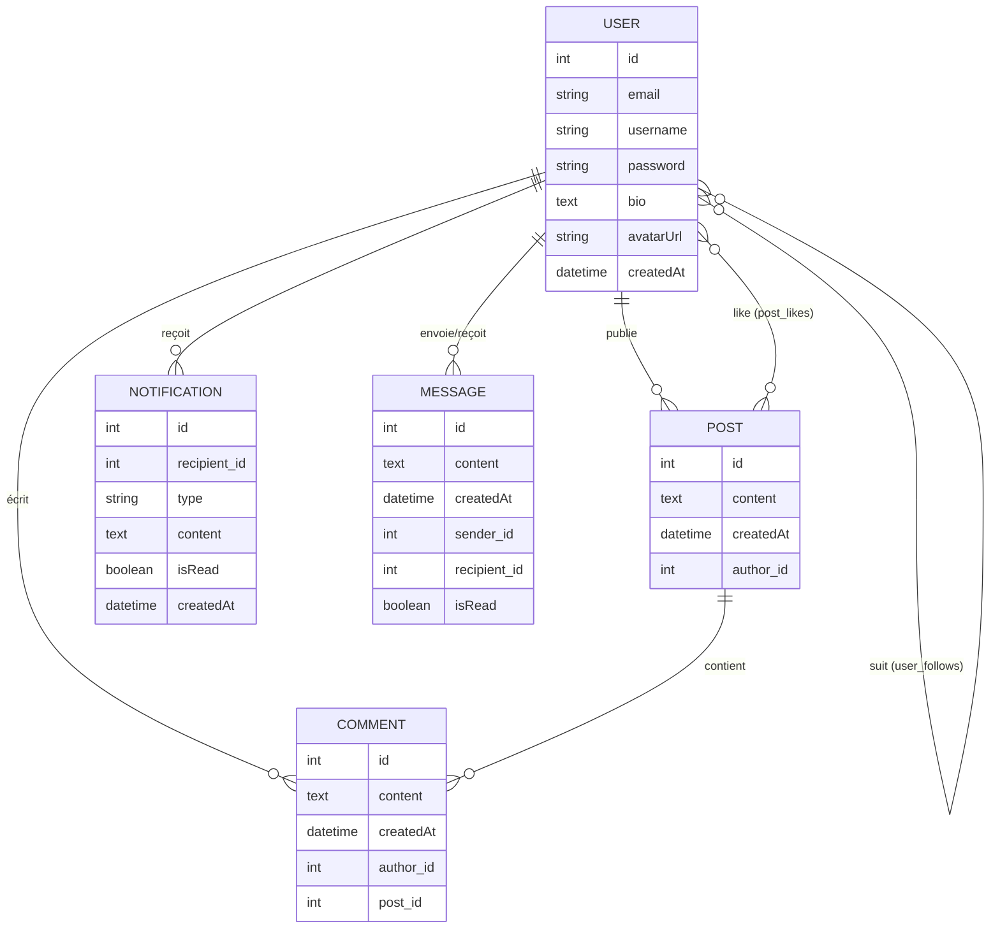

# SymfoConnect

SymfoConnect est un réseau social développé dans le cadre d'une évaluation Symfony 7. Ce projet est réalisé progressivement sur 3 jours.

## Jour 1 : Fondations et Pages Publiques

L'objectif du premier jour était de mettre en place la base du projet, le schéma de données et les premières pages interactives.

### Fonctionnalités réalisées :
- **Initialisation** : Projet Symfony 7 configuré avec AssetMapper et Doctrine ORM.
- **Base de données** : Intégration avec un environnement MySQL/Docker.
- **Entités** :
    - `User` : Gestion des utilisateurs (email, username, bio, avatar, etc.).
    - `Post` : Système de publications liées aux utilisateurs.
- **Pages Publiques** :
    - **Accueil (`/`)** : Fil d'actualité affichant les 10 derniers posts triés par date décroissante.
    - **Profil (`/profil/{username}`)** : Informations détaillées d'un utilisateur et liste de ses publications.
- **Interaction** :
    - **Création de Post (`/post/nouveau`)** : Formulaire sécurisé avec validation (longueur minimale, contenu obligatoire) et messages flash de confirmation.
- **Design** : Interface moderne "Glassmorphism" avec un layout responsive et premium.

---

## Installation et Lancement

### Prérequis
- PHP 8.2 ou supérieur
- Composer
- Docker (optionnel, pour la base de données automatique)
- Symfony CLI (recommandé)

### Installation
1. Cloner ou récupérer le dossier du projet.
2. Installer les dépendances :
   ```bash
   composer install
   ```
3. Configurer la base de données dans le fichier `.env` (déjà configuré pour le MySQL local/Docker par défaut).
4. Exécuter les migrations pour créer les tables :
   ```bash
   php bin/console doctrine:migrations:migrate
   ```
5. Charger les données de test (optionnel) :
   ```bash
   php bin/console doctrine:fixtures:load --no-interaction
   ```

### Données de TEST (Fixtures)
Le projet inclut un système de Fixtures (`src/DataFixtures/AppFixtures.php`) qui permet de peupler instantanément la base de données avec :
- L'utilisateur **Arikode** et 5 autres profils variés.
- Une dizaine de publications réalistes pour tester le fil d'actualité et les pages de profil.

### Lancement
Pour lancer le serveur de développement :
```bash
symfony serve -d
```
L'application sera accessible sur : **[https://127.0.0.1:8000](https://127.0.0.1:8000)**

---

## Structure de la BD (Actuelle)


## Jour 2 : Fonctionnalités Sociales et Sécurité

L'objectif du deuxième jour était de transformer le prototype en une véritable application sociale sécurisée.

### Fonctionnalités réalisées :
- **Authentification complète** :
    - Système d'inscription avec validation d'unicité (email/username) et hachage sécurisé des mots de passe.
    - Connexion/Déconnexion gérée via Symfony Security.
- **Sécurisation des contenus** :
    - Création de post réservée aux utilisateurs connectés.
    - Attribution automatique de l'auteur au post créé.
    - **PostVoter** : Seul l'auteur peut supprimer ses propres publications (protection 403).
- **Interactions Sociales** :
    - **Follow/Unfollow** : Possibilité de suivre d'autres utilisateurs depuis leur profil.
    - **Likes** : Système de "J'aime" sur les publications avec compteurs en temps réel.
    - **Fil d'actualité (`/feed`)** : Page regroupant exclusivement les posts des personnes suivies.
- **Système de Notifications** : Création automatique d'une notification en base de données quand un utilisateur est suivi.
- **Design Premium** : Amélioration de l'interface avec du **Glassmorphism** avancé, des animations (Animate.css) et une navigation dynamique.

---

## Structure de la BD (Finale Jour 2)


## Jour 3 : Finalisation, API et Messagerie

L'objectif du dernier jour était d'apporter les fonctionnalités avancées et de préparer l'application pour une utilisation réelle (API, performance, messagerie).

### Fonctionnalités réalisées :
- **Messagerie Privée** : 
    - Système de conversations entre utilisateurs.
    - Interface d'envoi et de réception de messages en temps réel (ou simulé via refresh).
    - Liste des conversations actives sur le profil.
- **Commentaires** :
    - Possibilité d'ajouter des commentaires sous chaque publication.
    - Affichage dynamique des commentaires dans le fil d'actualité.
- **API REST & Sécurité JWT** :
    - Exposition des ressources (`User`, `Post`, `Comment`) via **API Platform**.
    - Sécurisation des points d'entrée API avec **JWT** (LexikJWTAuthenticationBundle).
    - Documentation Swagger disponible sur `/api`.
- **Traitement Asynchrone (Messenger)** :
    - Configuration de Symfony Messenger pour la gestion des notifications en arrière-plan.
- **Optimisations et UI** :
    - **Cache** : Mise en place d'un système de cache sur le fil d'actualité pour améliorer les performances.
    - **Upload d'Avatar** : Système robuste de gestion des photos de profil.
    - **Refonte visuelle** : Feed style "Facebook" plus immersif.
- **Tests** : Mise en place de tests unitaires et fonctionnels avec PHPUnit pour garantir la stabilité.

---

## Structure de la BD (Version Finale)


## Technologies utilisées
- **Backend** : Symfony 7.4, PHP 8.3
- **Database** : MySQL (Doctrine ORM)
- **API** : API Platform, JWT
- **Frontend** : Twig, AssetMapper, Vanilla JS, CSS (Glassmorphism)
- **Outils** : Symfony CLI, Docker, PHPUnit, Messenger
