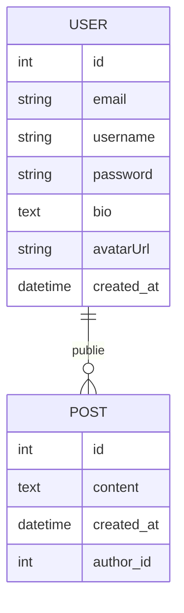

# SymfoConnect 🌐

SymfoConnect est un réseau social développé dans le cadre d'une évaluation Symfony 7. Ce projet est réalisé progressivement sur 3 jours.

## 📅 Jour 1 : Fondations et Pages Publiques

L'objectif du premier jour était de mettre en place la base du projet, le schéma de données et les premières pages interactives.

### Fonctionnalités réalisées :
- **Initialisation** : Projet Symfony 7 configuré avec AssetMapper et Doctrine ORM.
- **Base de données** : Intégration avec un environnement MySQL/Docker.
- **Entités** :
    - `User` : Gestion des utilisateurs (email, username, bio, avatar, etc.).
    - `Post` : Système de publications liées aux utilisateurs.
- **Pages Publiques** :
    - **Accueil (`/`)** : Fil d'actualité affichant les 10 derniers posts triés par date décroissante.
    - **Profil (`/profil/{username}`)** : Informations détaillées d'un utilisateur et liste de ses publications.
- **Interaction** :
    - **Création de Post (`/post/nouveau`)** : Formulaire sécurisé avec validation (longueur minimale, contenu obligatoire) et messages flash de confirmation.
- **Design** : Interface moderne "Glassmorphism" avec un layout responsive et premium.

---

## 🛠️ Installation et Lancement

### Prérequis
- PHP 8.2 ou supérieur
- Composer
- Docker (optionnel, pour la base de données automatique)
- Symfony CLI (recommandé)

### Installation
1. Cloner ou récupérer le dossier du projet.
2. Installer les dépendances :
   ```bash
   composer install
   ```
3. Configurer la base de données dans le fichier `.env` (déjà configuré pour le MySQL local/Docker par défaut).
4. Exécuter les migrations pour créer les tables :
   ```bash
   php bin/console doctrine:migrations:migrate
   ```

### Lancement
Pour lancer le serveur de développement :
```bash
symfony serve -d
```
L'application sera accessible sur : **[https://127.0.0.1:8000](https://127.0.0.1:8000)**

---

## 🏗️ Structure de la BD (Actuelle)


## 🚀 Prochaines étapes (Jour 2)
- Mise en place de l'**Authentification** (Login/Register).
- Système de **Follows** entre utilisateurs.
- Gestion des **Likes** sur les posts.
- Sécurisation des routes.
